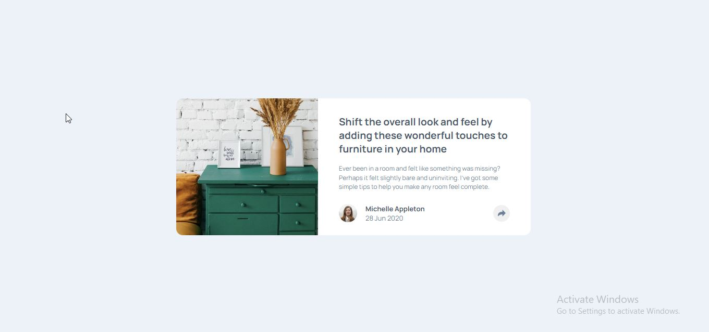

# Frontend Mentor - Article Preview Component Solution

This is my solution to the Article Preview Component challenge on Frontend Mentor. I built this project using a mobile-first approach and this project helped me improve my HTML and CSS skills, especially in layout, positioning, and creating interactive UI elements using JavaScript.

---

## Overview

### Links

* Solution URL: [Add your GitHub repo link here]
* Live Site URL: [Add your live site link here]

---

### Screenshot

---

## Built with

* Semantic HTML5
* CSS3
* Flexbox
* Mobile-first workflow
* JavaScript (for interactivity)

---

## What I learned

* How to build layouts using a mobile-first approach
* How to use Flexbox for alignment and structure
* How to position elements using relative and absolute positioning
* How to use JavaScript to create interactive UI (share popup button)

---

## Challenges I faced

* Positioning the share popup correctly across different screen sizes
* Making the layout responsive while following mobile-first design
* Handling the toggle functionality using JavaScript
* Managing spacing and alignment inside the card

---

## Continued development

* Improve my JavaScript skills for UI interactions
* Practice more responsive and mobile-first designs
* Write cleaner and more maintainable code

---

## Author

* Frontend Mentor - [@IrfanAnsari21](https://www.frontendmentor.io/profile/IrfanAnsari21)
* GitHub - [@IrfanAnsari21](https://github.com/IrfanAnsari21)

---

## Acknowledgments

Thanks to Frontend Mentor for providing this project to help improve front-end development skills.
